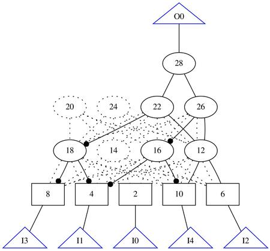

# AIG Synthesis via Local Search

Synthesize AIGs using local search.



## Files

- `main.cpp`: Main program that performs the simulation.
- `prepro.ipynb`: Jupyter notebook where preprocessing is performed. The underlying functions are in `mnist.py`. The preprocessing done now is to read LeCun's MNIST files, perform PCA to reduce dimensionality and save the data in the same format as the original MNIST files.

## Installation

To compile the C++ code:

```
make
```

To run the Python code, just make sure Numpy and Scikit-learn are installed.
